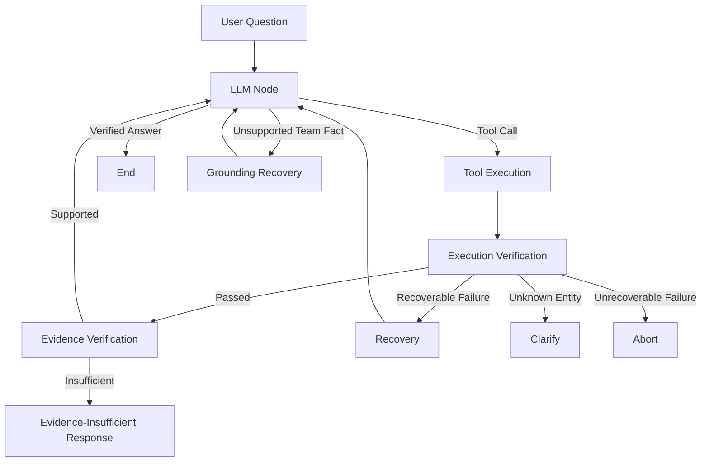

# Supersonic FC Agent

A domain-specific AI agent and full-stack platform for querying, maintaining, and presenting Supersonic FC team knowledge.

## Status

**Stable Alpha**

The main Agent workflow, RAG pipeline, web application, authentication, media management, and evaluation infrastructure are implemented.

## Live Deployment

- Web Application: **To be added**

## Overview

Supersonic FC Agent combines:

- LangGraph agent orchestration
- Structured Python tools
- Hybrid retrieval-augmented generation
- Grounding and evidence verification
- FastAPI backend
- React and TypeScript frontend
- Player authentication and match ratings
- Agent evaluation infrastructure

Exact facts such as player goals, shirt numbers, match results, and scorer rankings are resolved through structured tools.

Narrative questions about player characteristics, tactics, team culture, and match stories use a curated RAG knowledge base.

## Motivation

A language model may generate plausible but unsupported names, scores, or statistics when answering from memory.

This project separates structured facts from semantic retrieval and uses program-level verification before accepting factual answers.

It is an applied agent-engineering project rather than a claim of a novel agent algorithm.

## Agent Workflow



The production Agent entry point is:

```python
agent.workflow.run_graph.run_graph_agent
```

FastAPI invokes the LangGraph workflow instead of calling the LLM provider directly.

## Grounding and Verification

The workflow uses three safeguards.

### Execution Verification

Checks whether a tool executed successfully and returned a valid result.

### Evidence Verification

Checks whether the tool result supports the requested player, season, match, or fact.

### Grounding Gate

A factual Supersonic FC answer cannot end while evidence is still pending.

If the LLM answers a team-fact question without calling a tool, the workflow rejects the unsupported answer and enters grounding recovery.

Greetings and assistant-meta questions can still be answered directly.

## Implemented Tools

- `get_player_goals`
- `get_player_profile`
- `get_player_number`
- `get_scorer_ranking`
- `get_match_result`
- `search_team_knowledge`

Structured tools handle exact facts. The RAG tool handles qualitative and narrative knowledge.

## RAG Pipeline

```text
Metadata Filtering
        ↓
Dense Retrieval + BM25
        ↓
Reciprocal Rank Fusion
        ↓
Cross-Encoder Reranking
        ↓
Relevant Knowledge Chunks
```

Models currently used:

- Embedding: `BAAI/bge-small-zh-v1.5`
- Reranker: `BAAI/bge-reranker-base`

BM25 improves exact-name and keyword matching. Dense retrieval improves semantic recall. Reciprocal Rank Fusion combines both rankings before final reranking.

## System Architecture

```text
React Frontend
       │
       ▼
FastAPI Backend
       │
       ▼
LangGraph Agent
   ├── Structured Tools → Season JSON
   └── RAG Tool → Curated Knowledge Base
```

Additional backend modules provide:

- Public team-data APIs
- Administrator authentication
- Player activation and login
- Media management
- Match ratings
- Comments and likes

## Data Design

The project separates official team facts from mutable application data.

```text
data/seasons/     Official players, matches, teams and standings
data/rag/         Knowledge chunks and dense index
data/app.db       Authentication, ratings, comments and likes
data/media/       Media metadata
```

Runtime uploads and the SQLite database are excluded from Git.

## Product Features

### Public website

- Match results
- Season rosters
- Player profiles
- Standings and rankings
- Photo gallery
- AI Assistant
- Match rating pages

### Administration

- Backend-enforced administrator permissions
- Player and match data maintenance
- Bulk image uploads
- Explicit player-avatar selection
- Team crest management
- Player invitation generation

### Player community

- Invitation-based account activation
- Player login
- Match ratings
- Comments
- Rating and comment likes
- Season-specific rating permissions

## Project Structure

```text
agent/
├── workflow/       LangGraph state, nodes and routing
├── tools/          Structured tools and RAG tool
├── rag/            Retrieval and reranking
└── llm/            OpenAI-compatible LLM client

backend/
├── api/            FastAPI endpoints
├── ratings/        Rating and community data layer
└── main.py         Backend application entry point

frontend/           React and TypeScript application
data/               Season, RAG and media data
evals/              Agent evaluation infrastructure
tests/              Offline tests
docs/               Detailed architecture and deployment documentation
```

## Quick Start

Install backend dependencies:

```bash
python -m venv .venv
python -m pip install -r requirements.txt
```

Copy `.env.example` to `.env` and configure the LLM provider:

```dotenv
LLM_API_KEY=your_key_here
LLM_BASE_URL=https://dashscope.aliyuncs.com/compatible-mode/v1
LLM_MODEL=qwen-flash
```

Install frontend dependencies:

```bash
cd frontend
npm ci
```

Run the backend from the project root:

```bash
python -m uvicorn backend.main:app --host 127.0.0.1 --port 8000 --reload
```

Run the frontend in another terminal:

```bash
cd frontend
npm run dev
```

Detailed environment, authentication, and deployment instructions are available in [`docs/deployment.md`](docs/deployment.md).

## Example Queries

Structured fact:

```text
张谢童甲25-26赛季进了几个球？
```

Narrative knowledge:

```text
干宸浩有什么技术特点？
```

Unknown entity safety:

```text
火星梅西25-26赛季进了几个球？
```

For an unknown player, the Agent should request clarification instead of inventing a result.

## Evaluation

The project includes JSONL evaluation datasets, an injectable runner, structured workflow traces, mechanical metrics, and JSON/Markdown reports.

Evaluation can inspect:

- Tool selection
- Answer keywords
- Workflow outcome
- Tool execution status
- Evidence status
- Grounding recovery

The evaluation trace excludes prompts, credentials, tool arguments, and model reasoning.

## Testing

Run the offline test suite:

```bash
python -m pytest
```

Build the frontend:

```bash
cd frontend
npm run build
```

Automated tests use fake or mocked external services where appropriate.

## Deployment

The project supports:

- Ubuntu
- FastAPI and Uvicorn
- Nginx
- systemd
- Docker
- Offline loading of local embedding and reranker models

Production deployment details are documented in [`docs/deployment.md`](docs/deployment.md).

## Current Limitations

- Team-fact intent detection currently uses deterministic domain rules.
- Evidence verification is tool-specific rather than a general semantic verifier.
- Persistent multi-turn Agent memory is not implemented.
- Agent responses are non-streaming.
- RAG retrieval is designed for the current small knowledge base.
- SQLite and file-backed data are intended for a small single-server deployment.
- Horizontal scaling is not currently supported.
- Semantic groundedness evaluation remains planned work.

## Roadmap

- [ ] Add persistent multi-turn memory
- [ ] Add streaming responses
- [ ] Extend final-answer semantic verification
- [ ] Add formal HTTPS deployment links
- [ ] Add automated backup and monitoring
- [ ] Migrate mutable data if multi-instance deployment becomes necessary

## Project Focus

This repository demonstrates practical experience with:

- Agent state machines
- Tool calling
- Retrieval-augmented generation
- Grounding and evidence verification
- Recovery workflows
- Agent evaluation
- Full-stack integration
- Authentication and deployment

It does not claim general autonomous reasoning beyond the implemented Supersonic FC domain.
