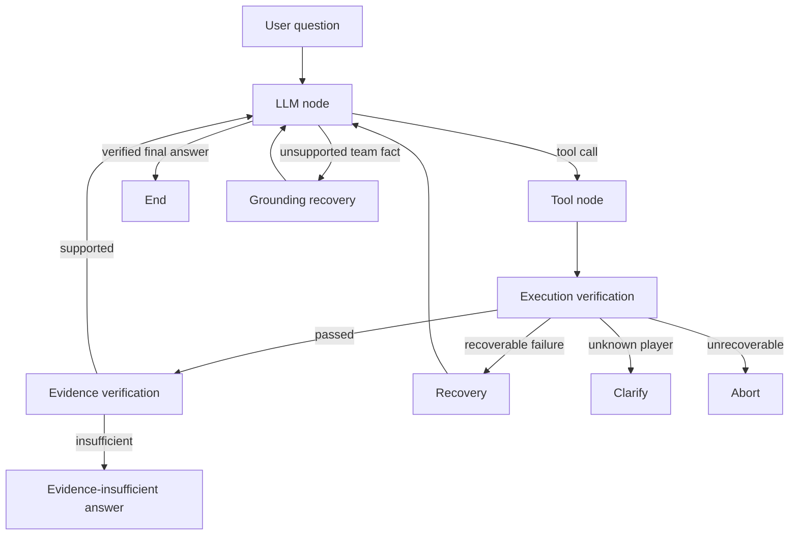

# Supersonic FC Agent

A domain-specific AI agent and web platform for querying, maintaining, and presenting Supersonic FC team knowledge.

## Status

**Stable Alpha** — the end-to-end product path is implemented and has been deployed on a small Ubuntu server. The project remains a team-scale system rather than a general-purpose sports platform.

## Overview

Supersonic FC Agent combines a LangGraph workflow, deterministic Python tools, a local hybrid RAG pipeline, FastAPI, and a React frontend. It answers exact questions such as player goals and match results from structured season data, while retrieving narrative knowledge such as player characteristics and team stories from a curated knowledge base.

The project also includes media administration, player activation and login, match ratings, comments and likes, offline evaluation infrastructure, and deployment configuration. Official team facts remain separate from user-generated community data.

## Motivation

Sports knowledge mixes exact records with narrative context. A language model may produce plausible but unsupported names, scores, or statistics if it is allowed to answer directly. This project explores a practical agent architecture in which exact facts are resolved through structured tools, descriptive knowledge is retrieved through RAG, and program-level workflow checks prevent unsupported team-fact answers from terminating successfully.

It is an applied agent-workflow project, not a claim of a novel agent algorithm or a general sports intelligence system.

## Agent Workflow



The production entry point is `agent.workflow.run_graph.run_graph_agent`. FastAPI invokes this function rather than calling the model provider directly. The older loop under `agent/core/` is retained as an earlier implementation path; the product API uses the LangGraph workflow.

## Implemented Features

### Agent and grounding

- LangGraph state with explicit tool, verification, recovery, clarification, abort, and grounding-recovery paths
- OpenAI-compatible chat-completions client with configurable provider, base URL, model, and tool calling
- Structured tools for player goals, player profile, shirt number, scorer ranking, and match results
- RAG tool for player characteristics, tactics, team history, and other narrative knowledge
- Deterministic execution checks and tool-specific evidence checks
- Grounding gate that rejects direct, unsupported answers to team-fact questions
- Separate handling for greetings and assistant-meta questions that do not require a tool
- Bounded tool and recovery retries to avoid infinite loops

### Retrieval

- Curated JSON chunks with season and entity metadata
- Chinese BM25 retrieval and dense retrieval with `BAAI/bge-small-zh-v1.5`
- Reciprocal Rank Fusion for hybrid candidate ranking
- Cross-encoder reranking with `BAAI/bge-reranker-base`
- Prebuilt local dense index and offline model-loading support for deployment

### Product application

- FastAPI endpoints for agent chat, players, matches, standings, scorer and assist tables, gallery media, ratings, and authentication
- React 19 and TypeScript frontend for team data, AI chat, media, and match ratings
- Single-administrator authentication with backend-enforced write permissions
- Player invite activation, login, and persistent server-side sessions
- Player ratings, comments, and likes backed by SQLite
- Bulk image upload with explicit player-avatar and team-crest assignment
- Dataset validation, RAG acceptance checks, unit tests, and agent evaluation reports

## Architecture

```text
React frontend
    │ HTTP / JSON
    ▼
FastAPI
    ├── public team-data APIs
    ├── admin and player authentication
    ├── rating and community APIs
    └── LangGraph product entry point
            ├── structured tools → season JSON
            └── RAG tool → BM25 + dense retrieval → RRF → reranker
```

### Data boundaries

- `data/seasons/` is the versioned source of truth for official players, matches, teams, standings, and season status.
- `data/rag/` contains curated narrative chunks and the prebuilt dense index.
- `data/app.db` stores mutable authentication, rating, comment, and like data and is excluded from Git.
- `backend/static/uploads/` contains runtime uploads and is excluded from Git.

Exact statistics are read or derived from structured season records. The frontend does not maintain a separate player, match, ranking, or gallery dataset.

## Project Structure

```text
agent/
  workflow/       LangGraph state, nodes, routing, and product runner
  tools/          structured team tools and the RAG tool
  rag/            BM25, dense retrieval, fusion, and reranking
  llm/            configurable OpenAI-compatible client
backend/
  api/            FastAPI route modules
  ratings/        SQLite schema, repository, service, and seed logic
frontend/         React and TypeScript application
data/
  seasons/        official season data
  rag/            chunks and dense index
  media/          versioned media metadata seed
evals/            datasets, runner, trace adapter, evaluator, and reports
scripts/          data validation and dense-index build commands
tests/            offline unit and integration tests
docs/             API, data-maintenance, architecture, and deployment notes
```

## Setup

Python 3.11 and Node.js 20 are recommended.

```bash
git clone https://github.com/zzzxtjjj/Supersonic_fc_agent.git
cd Supersonic_fc_agent

python -m venv .venv
```

Activate the environment, then install the backend dependencies:

```bash
python -m pip install -r requirements.txt
```

Copy `.env.example` to a local `.env` and provide backend-only values. At minimum, live agent calls require:

```dotenv
LLM_API_KEY=your_key_here
LLM_BASE_URL=https://dashscope.aliyuncs.com/compatible-mode/v1
LLM_MODEL=qwen-flash
```

Administrator access additionally requires `ADMIN_USERNAME`, `ADMIN_PASSWORD_HASH`, and a `SESSION_SECRET` of at least 32 characters. Generate values locally with:

```bash
python -m backend.auth_cli hash-password
python -m backend.auth_cli generate-secret
```

Do not commit `.env`, `data/app.db`, or uploaded media.

Install the frontend dependencies:

```bash
cd frontend
npm ci
cd ..
```

## Running the Project

Start the backend from the repository root:

```bash
python -m uvicorn backend.main:app --host 127.0.0.1 --port 8000 --reload
```

Start the frontend in a second terminal:

```bash
cd frontend
npm run dev
```

Development URLs:

- Frontend: `http://127.0.0.1:5173`
- API: `http://127.0.0.1:8000`
- OpenAPI documentation: `http://127.0.0.1:8000/docs`
- Health check: `http://127.0.0.1:8000/api/health`

Initialize the local rating and player-auth database without overwriting existing community data:

```bash
python -m backend.ratings.seed
```

Validate data and run the offline test suite:

```bash
python -m scripts.validate_chunks
python -m scripts.validate_season_data --season 25-26
python -m scripts.validate_season_data --season 26-27
python -m pytest

cd frontend
npm run build
```

## Example Usage

### Structured fact

```text
Question: 张谢童甲25-26赛季进了几个球？
Path: LLM → get_player_goals → execution verification → evidence verification → answer
```

### Narrative knowledge

```text
Question: 干宸浩有什么技术特点？
Path: LLM → search_team_knowledge → hybrid retrieval and reranking → evidence verification → answer
```

### Unknown entity

```text
Question: 火星梅西25-26赛季进了几个球？
Path: structured tool failure → deterministic clarification
```

If the model tries to answer the last question without a tool, the grounding gate routes it to recovery instead of accepting the unsupported answer.

## Evaluation

Evaluation cases are human-authored JSONL records. The runner accepts an injected agent callable, isolates case failures, computes mechanical metrics, and writes JSON and Markdown reports. The live adapter records a small structured trace containing tool calls and results, execution and evidence status, grounding recovery, and one workflow outcome. It does not record prompts, tool arguments, credentials, or model reasoning.

Run infrastructure tests without a live model:

```bash
python -m pytest
```

A real evaluation requires an explicit `--live` flag:

```bash
python -m evals.run_eval --dataset evals/datasets/smoke.jsonl --live
```

## Deployment

The repository includes a multi-stage Dockerfile that builds the React frontend, installs the Python service, downloads the two RAG models at image-build time, and runs one Uvicorn worker. The documented small-server deployment uses Nginx for static files and reverse proxying, with FastAPI managed by systemd.

See [`docs/deployment.md`](docs/deployment.md) for environment variables, persistent storage, health checks, and release steps.

## Current Limitations

- Team-fact intent detection uses deterministic domain rules and may require maintenance as query patterns expand.
- Evidence checks validate known tool outputs and entity/season alignment; they are not a general semantic final-answer verifier.
- `session_id` is part of the API contract, but persistent multi-turn agent memory is not implemented.
- Agent responses are non-streaming.
- The local RAG corpus is scanned in process and is designed for the current small knowledge base, not large-scale retrieval.
- Official data and media metadata are file-backed; the current deployment intentionally uses one application worker.
- SQLite and in-memory administrator sessions are suitable for the current team-scale deployment, not horizontal scaling.
- Production authentication requires HTTPS for secure cookies.
- Evaluation V1 performs human-specified mechanical checks; semantic correctness and groundedness judging remain planned work.

## Roadmap

- [ ] Add persistent, scoped multi-turn conversation memory
- [ ] Add streaming responses and user-visible workflow progress
- [ ] Extend final-answer evidence and semantic evaluation
- [ ] Add HTTPS-domain deployment, automated backup, and operational monitoring
- [ ] Migrate mutable data and sessions when multi-instance deployment is required
- [ ] Replace linear dense retrieval if the knowledge base grows beyond the current team-scale corpus

## What I Learned / Project Focus

This project documents practical work on agent state machines, tool and RAG boundaries, deterministic safety routing, offline evaluation, full-stack integration, access control, data ownership, and deployment. It does not claim a novel agent architecture or autonomous decision-making beyond the implemented football-team domain.
